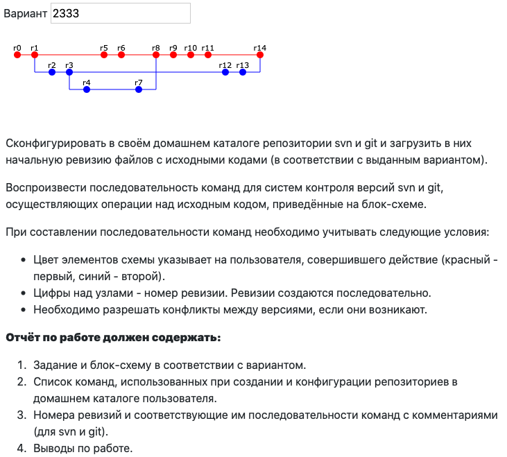

# МИСПИ Лабораторная №2

### Системы контроля версий. Вариант 2333

| Выполнил      | Группа | Преподаватель |
| ------------- | ------ | ------------- |
| Яковлев Г. А. | P3213  | Письмак А. Е. |

## Задание



## svn листинг

```shell
rm -rf svn_lab2
rm -rf workdir
svnadmin create svn_lab2
cd svn_lab2

export URL_SVN_PATH=file:///Users/ykvlv/software-engineering/lab2/svn_lab2

svn mkdir -m "pj" $URL_SVN_PATH/trunk $URL_SVN_PATH/branches
cd ..
svn checkout $URL_SVN_PATH/trunk workdir
cd workdir

cp ../r/r0/* .
svn add *
svn commit -m "r0: добавлена возможность ввода чисел" --username="Grigory Yakovlev"

cp ../r/r1/* .
svn commit -m "r1: добавлено преобразование чисел в int" --username="Grigory Yakovlev"

svn copy $URL_SVN_PATH/trunk $URL_SVN_PATH/branches/feature_operations -m 'feature_operations' --username="Martin Raila"
svn switch $URL_SVN_PATH/branches/feature_operations
cp ../r/r2/* .
svn add op.py
svn commit -m "r2: добавлен файл с мат. операциями" --username="Martin Raila"

cp ../r/r3/* .
svn commit -m "r3: добавлена первая операция (сложение)" --username="Martin Raila"

svn copy $URL_SVN_PATH/branches/feature_operations $URL_SVN_PATH/branches/feature_choice_operations -m 'feature_choice_operations' --username="Martin Raila"
svn switch $URL_SVN_PATH/branches/feature_choice_operations
cp ../r/r4/* .
svn commit -m "r4: добавлена возможность ввода операции" --username="Martin Raila"

svn switch $URL_SVN_PATH/trunk
cp ../r/r5/* .
svn commit -m "r5: улучшен ввод чисел" --username="Grigory Yakovlev"

cp ../r/r6/* .
svn commit -m "r6: добавлена проверка на int с принудительным вводом" --username="Grigory Yakovlev"

svn switch $URL_SVN_PATH/branches/feature_choice_operations
cp ../r/r7/* .
svn commit -m "r7: добавлено приглашение к выбору операции" --username="Martin Raila"

svn switch $URL_SVN_PATH/trunk
svn up
svn merge $URL_SVN_PATH/branches/feature_choice_operations
---------------------------------------------------------------------------------------
cp ../r/r8/* .
svn resolved main.py
svn commit -m "r8: сморжена ветка feature_choice_operations и устранен конфликт слияния" --username="Grigory Yakovlev"

cp ../r/r9/* .
svn commit -m "r9: добавлена вторая операция (вычитание)" --username="Grigory Yakovlev"

cp ../r/r10/* .
svn commit -m "r10: улучшено приглашение к выбору операции" --username="Grigory Yakovlev"

cp ../r/r11/* .
svn commit -m "r11: добавлена проверка на наличие операции с принудительным вводом" --username="Grigory Yakovlev"

svn switch $URL_SVN_PATH/branches/feature_operations
svn mv op.py operations.py
cp ../r/r12/* .
svn commit -m "r12: добавлены остальные математические операции" --username="Martin Raila"

cp ../r/r13/* .
svn commit -m "r13: добавлен подробный вывод ответа" --username="Martin Raila"

svn switch $URL_SVN_PATH/trunk
svn up
svn merge $URL_SVN_PATH/branches/feature_operations
-----------------------------------------------------------------------------------------
svn rm op.py
cp ../r/r14/* .
svn resolved main.py
svn commit -m "r14: сморжена ветка feature_operations и устранены конфликты слияния" --username="Grigory Yakovlev"
```

## git листинг

```shell
rm -rf git_lab2
mkdir git_lab2
cd git_lab2

git init
git config --local user.name "Grigory Yakovlev"
git config --local user.email "ykvlv@niuitmo.ru"
cp ../r/r0/* .
git add .
git commit -m "r0: добавлена возможность ввода чисел"

cp ../r/r1/* .
git add .
git commit -m "r1: добавлено преобразование чисел в int"

git config --local user.name "Martin Raila"
git config --local user.email "raila@google.com"
git checkout -b feature_operations
cp ../r/r2/* .
git add .
git commit -m "r2: добавлен файл с мат. операциями"

cp ../r/r3/* .
git commit -am "r3: добавлена первая операция (сложение)"

git checkout -b feature_choice_operations
cp ../r/r4/* .
git commit -am "r4: добавлена возможность ввода операции"

git config --local user.name "Grigory Yakovlev"
git config --local user.email "ykvlv@niuitmo.ru"
git checkout master
cp ../r/r5/* .
git commit -am "r5: улучшен ввод чисел"

cp ../r/r6/* .
git commit -am "r6: добавлена проверка на int с принудительным вводом"

git config --local user.name "Martin Raila"
git config --local user.email "raila@google.com"
git checkout feature_choice_operations
cp ../r/r7/* .
git commit -am "r7: добавлено приглашение к выбору операции"

git config --local user.name "Grigory Yakovlev"
git config --local user.email "ykvlv@niuitmo.ru"
git checkout master
git merge feature_choice_operations
---------------------------------------------------
cp ../r/r8/* .
git commit -am "r8: сморжена ветка feature_choice_operations и устранен конфликт слияния"

cp ../r/r9/* .
git commit -am "r9: добавлена вторая операция (вычитание)"

cp ../r/r10/* .
git commit -am "r10: улучшено приглашение к выбору операции"

cp ../r/r11/* .
git commit -am "r11: добавлена проверка на наличие операции с принудительным вводом"

git config --local user.name "Martin Raila"
git config --local user.email "raila@google.com"
git checkout feature_operations
git mv op.py operations.py
cp ../r/r12/* .
git commit -am "r12: добавлены остальные математические операции"

cp ../r/r13/* .
git commit -am "r13: добавлен подробный вывод ответа"

git config --local user.name "Grigory Yakovlev"
git config --local user.email "ykvlv@niuitmo.ru"
git checkout master
git merge feature_operations
---------------------------------------------------
git rm op.py
cp ../r/r14/* .
git commit -am "r14: сморжена ветка feature_operations и устранены конфликты слияния"
```

## Вывод

Линус Торвальдс — гений, лучший человек на планете. Я хочу чтобы он жил вечно. А еще я научился работать с git и svn. Изучил их основные команды, научился создавать новые ветки, менять пользователя, разрешать конфликты. 

